<!--
  @authormark v1 -- do not remove (authorship watermark)⁠​​‌‌​​​‌​‌​​​‌​‌​‌‌‌​​‌‌​‌​‌​​‌‌​‌‌​‌​‌​​​‌‌‌​​​​​‌‌​‌​‌​‌‌​‌‌‌‌​‌‌​‌‌‌‌​‌‌​‌​​‌​‌‌​‌​‌​​‌​‌​‌‌‌​‌​​‌​‌​​‌‌‌‌​​​​‌​​‌​‌‌​‌​​​‌‌​​‌‌​​​​‌​‌‌‌​‌‌​​‌​​​‌‌​​‌‌‌‌​​​​‌​​‌​‌​​‌​​‌‌​‌⁠
  Copyright (c) 2026 Srinivasan Vijayaraghavan <srinivasan.shyam2000@gmail.com>
  Author: https://github.com/Srinivasan-78
  SPDX-License-Identifier: MIT
  Fingerprint: AMK1.1EsSj85ooijWJxKFavFxJM
-->
# srinidevops.com — the whole site, explained

This repository is a personal website: the portfolio of **Srinivasan Vijayaraghavan**,
a DevOps & Cloud Architecture engineer in Bangalore. It lives at **[www.srinidevops.com](https://www.srinidevops.com)**.

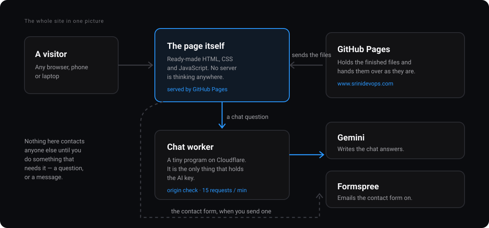

The unusual thing about it is what is *missing*. There is no database. There is no
server sitting in a data centre waiting for visitors. Almost the entire site is a pile
of ready-made static files that a browser downloads and renders, which is why it is fast, free
to host, and impossible to knock over.

---

## Table of contents

1. [The one-minute version](#1-the-one-minute-version)
2. [Explaining it plainly](#2-explaining-it-plainly)
3. [What is on the screen](#3-what-is-on-the-screen)
4. [The pages, one by one](#4-the-pages-one-by-one)
5. [What happens when you open the site](#5-what-happens-when-you-open-the-site)
6. [Type it once, use it six times](#6-type-it-once-use-it-six-times)
7. [The chat button, and where the secret lives](#7-the-chat-button-and-where-the-secret-lives)
8. [The contact form, with no post office](#8-the-contact-form-with-no-post-office)
9. [Light, dark, and the flash that never happens](#9-light-dark-and-the-flash-that-never-happens)
10. [Movement, and knowing when to stop](#10-movement-and-knowing-when-to-stop)
11. [The map of the repository](#11-the-map-of-the-repository)
12. [How it gets onto the internet](#12-how-it-gets-onto-the-internet)
13. [Running it on your own computer](#13-running-it-on-your-own-computer)
14. [Changing things without breaking them](#14-changing-things-without-breaking-them)
15. [Words you might not know](#15-words-you-might-not-know)

---

## 1. The one-minute version

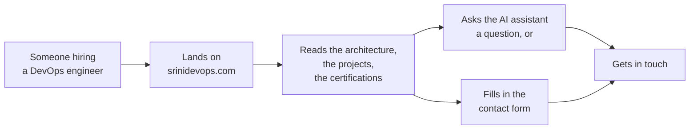

Everything in this repository exists to move a visitor from box **B** to box **F**.
Every design decision below — strict Apple typography, 60-30-10 palette, zero text descender cutoffs,
calm interactive blueprints, no stock photography — is in service of that, and nothing else.

**The numbers, as the site stands today:** 19 production builds, 24 verified certifications,
four primary navigation routes, and 32 statically compiled pages produced by the Next.js build.

---

## 2. Explaining it plainly

Most websites work like a restaurant. You ask for a page, a kitchen somewhere cooks
it fresh — looks things up in a database, assembles the page, sends it back — and you
wait while that happens. Every visitor makes the kitchen work again.

This site works like a **vending machine**. Every page was made in advance, wrapped,
and stacked in the machine. When you ask for one, it drops out. Nobody cooks anything.

Making them in advance is a job called **the build**. It happens once, on a computer
GitHub lends us for a few minutes, and it turns the source code in this repository
into a folder of finished pages (`out/`). That folder is what visitors actually get.

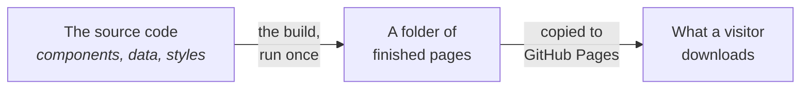

Three things follow from that, and they explain most of this repository:

- **It cannot go down under load.** Handing over a static file is the easiest thing a
  web server does. A thousand visitors at once is not a problem to solve.
- **It costs nothing.** GitHub Pages hosts it free with global edge distribution.
- **It cannot keep a secret.** Anything shipped to the browser can be read by anyone
  who looks — so the one secret this site needs, the AI key, is kept somewhere else
  entirely. That is [section 7](#7-the-chat-button-and-where-the-secret-lives), and
  it is the most interesting part of the build.

---

## 3. What is on the screen

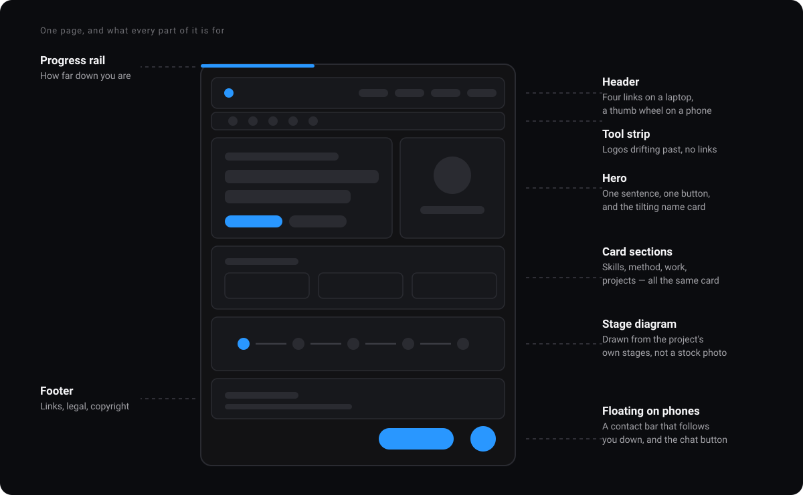

Every page is assembled from the same small set of high-performance components:

| Part | What it is | Where it lives |
| --- | --- | --- |
| **Progress rail** | A hairline at the very top that fills as you scroll. Passive frame-coalesced listener. | `components/ProgressRail.tsx` |
| **Header** | The site name, four navigation links, and the light/dark switch. Sticks to the top as you scroll. | `components/Nav.tsx` |
| **Tool strip** | Logos of the tools the work is built with, drifting slowly past. Deliberately *not* links. | `components/TechLoop.tsx` |
| **Hero Pipeline** | An interactive 5-stage release blueprint showing automated gating, containerization, and safety loops. | `components/AppleHeroPipeline.tsx` |
| **Skills Workbench** | 5 engineering domains with an interactive workbench displaying real-world production use cases. | `components/AppleSkillsExperience.tsx` |
| **Enterprise Case Studies** | 6 initiatives across Thomson Reuters and Granite River Labs with measurable impact metrics and upstream MR links. | `components/AppleEnterpriseExperience.tsx` |
| **Work Authorization** | Interactive digital clearance pass with live synchronized clocks for EST, IST, and UTC. | `components/AppleWorkAuthorization.tsx` |
| **Stage Diagram** | A declarative release stage diagram, drawn from real deployment data with automated rollback verification. | `components/SystemDiagram.tsx` |
| **Bento Cards** | Proximity mesh glow cards that track cursor movement smoothly without React re-renders. | `components/ui/GlowCard.tsx` |
| **Footer** | Dynamic copyright year, legal policies, and direct verified external channels. | `components/Footer.tsx` |
| **Sticky bar** | On mobile screens: a persistent résumé download and contact bar respecting safe-area insets. | `components/StickyCta.tsx` |
| **AI Assistant** | Bottom-right on every page. Real-time streaming assistant with WebGL background. | `components/ChatWidget.tsx` |

Two of those deserve a note:

**The tool strip is not a set of links.** A row of a dozen logos that are all links
puts a dozen keyboard stops between "skip to content" and the actual navigation, and
every one of them leaves the site — while moving, under a pointer that is trying to
land on one. They are a statement of what the work is made of, so they are inert.

**On a narrow screen the header links disappear** and are replaced by a full-screen
menu built around a curved 3D rotary wheel you can flick with a thumb
(`components/navigation/OptionWheel.tsx`). Five text links squeezed into a 320-pixel
bar is not a menu, it is a horizontal scroll. Both interfaces read from the same list
in `lib/nav.ts`, so a new page appears in both or in neither.

---

## 4. The pages, one by one

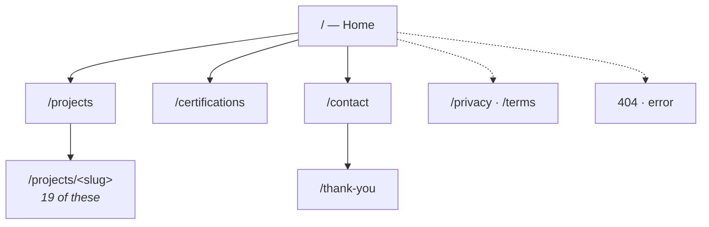

| Page | What it is for |
| --- | --- |
| **Home** (`app/page.tsx`) | The complete engineering story: human headline, metrics counters, zero-downtime release diagram, interactive skills matrix, enterprise case studies, projects gateway, work authorization clearance terminal, and closing CTA. |
| **Projects** (`app/projects/page.tsx`) | Real-time searchable directory of 19 builds, 7 category filter chips with live counts, flagship build spotlight, status beacons, live hosted demo links, and GitHub repositories. |
| **Project Detail** (`app/projects/[slug]/page.tsx`) | 19 static pages detailing system architecture, execution flow diagrams, highlights, tech stack badges, and sequential Previous/Next project pagination. |
| **Certifications** (`app/certifications/page.tsx`) | 24 verified credentials across 4 tracks, yearly growth timeline counters, instant keyword search, and permanent LinkedIn Learning verification links. |
| **Contact** (`app/contact/page.tsx`) | Accessible contact form with live character counter, haptic feedback, Formspree integration, and 1-click clipboard email copy card. |
| **Thank You** (`app/thank-you/page.tsx`) | Delivery confirmation with next-step navigation. Marked `noindex` so it never appears in search engine results. |
| **Privacy / Terms** (`app/privacy/page.tsx` & `app/terms/page.tsx`) | Clean, dual-theme legal notices explaining cookieless analytics and static hosting. |
| **404 / Error** (`app/not-found.tsx` & `app/error.tsx`) | Accessible error boundaries and dead-end catchers with quick-navigation cards and recovery actions. |

---

## 5. What happens when you open the site

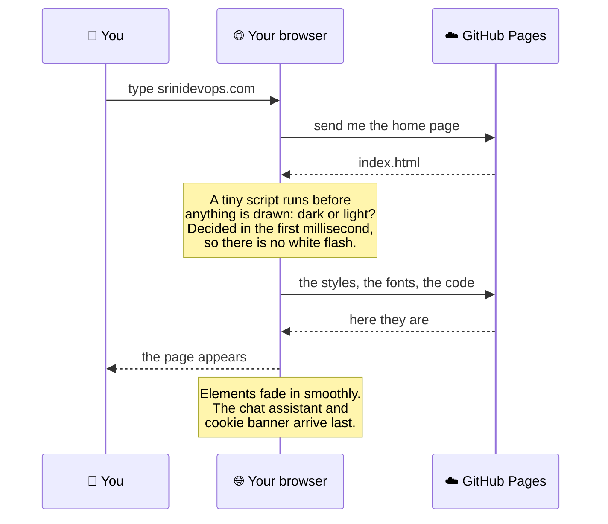

The fonts are self-hosted. They are downloaded from GitHub Pages with everything
else, not fetched from an external font service. Nothing on this page contacts a third party until *you* do
something that requires it.

---

## 6. Type it once, use it six times

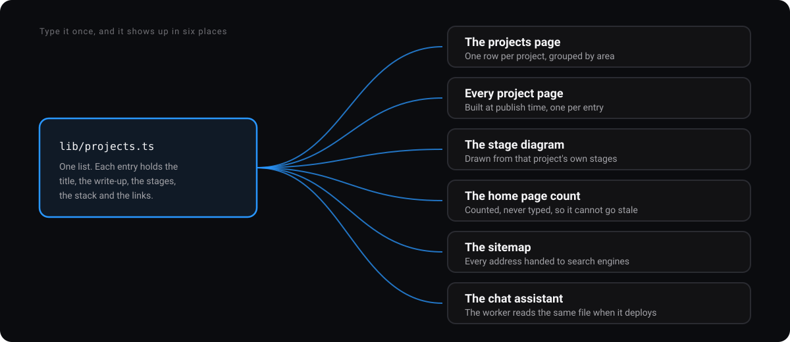

The projects are not hardcoded into individual pages. They live in one centralized dataset —
`lib/projects.ts` — and multiple parts of the site read that same list:

Add a project to `lib/projects.ts` and it:
1. Appears on `/projects` with instant search and category filtering.
2. Generates its own static `/projects/[slug]` route and architecture diagram.
3. Automatically updates the total build count across the Home page and 404 page.
4. Appears in the sequential Previous/Next pagination bar on project detail pages.
5. Injects into the XML sitemap (`app/sitemap.ts`) for search engines.
6. Reaches the streaming AI assistant on the next deploy.

- `lib/certs.ts`: 24 certifications and skills, feeding both `/certifications` and the homepage metrics counter.
- `lib/nav.ts`: Primary navigation routes, shared by the desktop header and mobile 3D wheel.
- `lib/knowledge.ts`: Self-contained, deterministic knowledge engine powering the interactive site assistant.

---

## 7. The interactive assistant: zero latency, zero server costs

Every page has a chat assistant. Ask it about Srinivasan's experience, US/India work authorization, 20 builds, enterprise case studies, or tech stack and it answers smoothly in real-time.


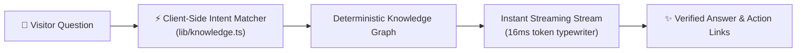

### Key Engineering Decisions:
1. **Deterministic & 100% Verified**: Zero AI hallucinations. Quotes exact verified credentials, timelines, metrics, and architecture links.
2. **Zero External Dependencies**: No Cloudflare Worker, no external API keys, no monthly server costs, and no rate limit failures.
3. **100% Offline & Instant**: Operates locally with 0ms network latency across static hosting and local development.
4. **Contextual Action Links & Follow-up Chips**: Provides 1-click links to download résumés, view project blueprints, and ask follow-up questions.


---

## 8. The contact form, with no post office

A static site cannot run a mail daemon. So the contact form securely dispatches messages through **Formspree**.

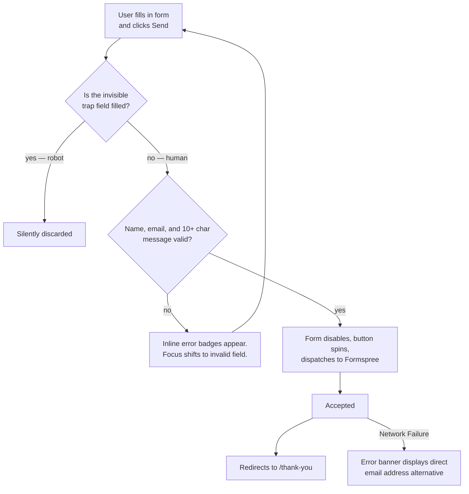

Key implementations:
- **Honeypot Protection**: Hidden `_gotcha` field silently drops automated spam submissions.
- **Progressive Enhancement**: Works as a native HTML form even with JavaScript disabled.
- **Tactile Feedback**: Haptic feedback triggers on submit and validation errors.
- **One-Click Email Copy**: Dedicated card allows 1-click clipboard copying with toast confirmation.

---

## 9. Light, dark, and the flash that never happens

The site ships **dark by default**, written into the initial server HTML markup.

The theme toggle in the header writes your preference to `localStorage`. An inline boot script executes *before the first pixel paints* to apply `data-theme="light"` without any layout shift or theme flash.

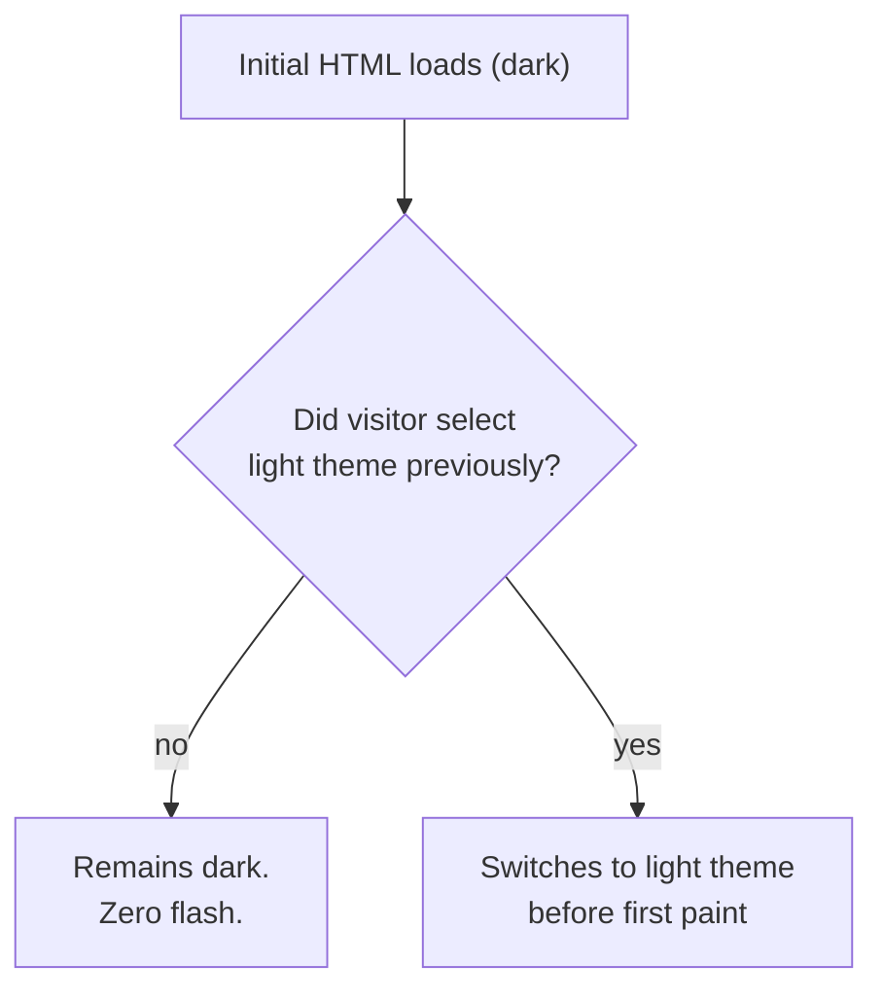

The color system strictly adheres to the **60-30-10 rule**:
- **60% Dominant Canvas**: Pure white (`#ffffff`) or Deep Matte Black (`#000000` / `#09090c`).
- **30% Structural Ink**: High-contrast typography (`#1d1d1f` light / `#f5f5f7` dark) and hairline borders (`rgba(0,0,0,0.1)` / `rgba(255,255,255,0.1)`).
- **10% Functional Accents**: Amber (`#e5a93b`) for craft eyebrows, Blue (`#0066cc` / `#2997ff`) for actions, and Emerald (`#34c759`) for live status beacons.

---

## 10. Movement, and knowing when to stop

Animations are lightweight, subtle, and compositor-driven. Heading reveals, metric counters, proximity card glows, and click sparks execute through `IntersectionObserver` and CSS transitions without tying calculations to continuous scroll ticks.

**Accessibility First**: If a visitor's device has `prefers-reduced-motion: reduce` enabled, all animations, transforms, and particle canvas loops are disabled instantly.

---

## 11. The map of the repository

```
app/                        Next.js App Router static pages
  layout.tsx                Root frame: nav, footer, theme boot script, AI assistant
  page.tsx                  Home: Hero, metrics, diagram, skills, experience, auth pass
  projects/page.tsx         Projects directory with real-time keyword search
  projects/[slug]/page.tsx  19 static project detail pages with Previous/Next pagination
  certifications/page.tsx   24 verified credentials with timeline counters & filter chips
  contact/page.tsx          Contact form, copy-to-clipboard email card, direct channels
  privacy · terms · thank-you · not-found · error · global-error
  sitemap.ts · robots.ts · manifest.ts    Framework-native metadata generators
  globals.css               Apple design tokens, light/dark themes, animations

components/                 Modular UI and architecture components
  Nav · Footer · ProgressRail · StickyCta · CookieNotice · Analytics
  AppleHeroPipeline         Interactive 5-stage release pipeline showcase
  AppleSkillsExperience     Interactive 5-domain engineering workbench
  AppleEnterpriseExperience 6 enterprise case study matrix across TR and GRL
  AppleWorkAuthorization    Digital clearance pass with live EST/IST/UTC clocks
  CopyEmailCard             1-click clipboard copy email component
  ProjectIndex · CertIndex  Search & filter matrix engines
  SystemDiagram             Declarative deployment flowchart with rollback loop
  Reveal · SplitReveal      Accessible scroll-triggered typographic animations
  Bits (CountUp)            Dynamic number counter with layout-effect sync
  ChatWidget                Streaming AI assistant with WebGL Strands background
  ContactForm               Accessible form with live character counter & Formspree
  navigation/OptionWheel    Curved 3D rotary navigation wheel for mobile
  ui/GlowCard               Proximity mesh border-glow card container

lib/                        Centralized datasets and shared utilities
  projects.ts               20 project architectural records
  certs.ts                  24 verified credentials and skill groupings
  nav.ts                    Canonical route definitions
  knowledge.ts · chat.ts    Deterministic knowledge base & query matcher
  seo.ts                    Structured metadata and social graph builder
  haptics.ts · useInView.ts Vibration feedback & viewport trigger hooks

public/                     Static assets, icons, résumé PDF, CNAME
.github/workflows/deploy.yml GitHub Actions static export deployment pipeline
```

---

## 12. How it gets onto the internet

Publishing is controlled via GitHub Actions:

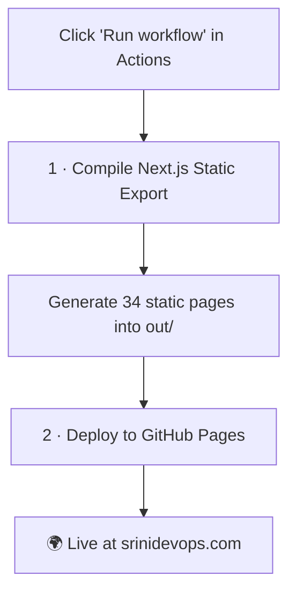

---

## 13. Running it on your own computer

**Requirements**: Node.js 18+ (Node.js 22 recommended).

```bash
# 1. Install dependencies
npm install

# 2. Run local development server
npm run dev          # http://localhost:3000

# 3. Typecheck and build production export
npm run typecheck    # verify TypeScript strict types
npm run build        # compile 34 static export pages into out/
```

---

## 14. Contact & Credentials

- **Direct Email**: [srinivasan.shyam2000@gmail.com](mailto:srinivasan.shyam2000@gmail.com)
- **LinkedIn**: [linkedin.com/in/srini-solution-architect](https://www.linkedin.com/in/srini-solution-architect/)
- **GitHub**: [github.com/Srinivasan-78](https://github.com/Srinivasan-78)
- **Location**: Bangalore, India (Authorized for US & India employment)

