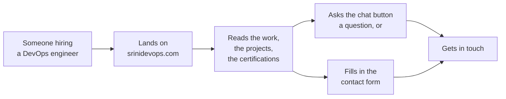
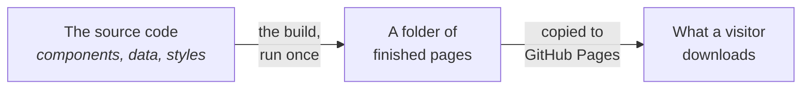
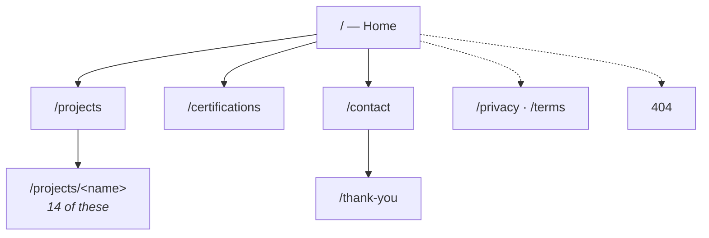
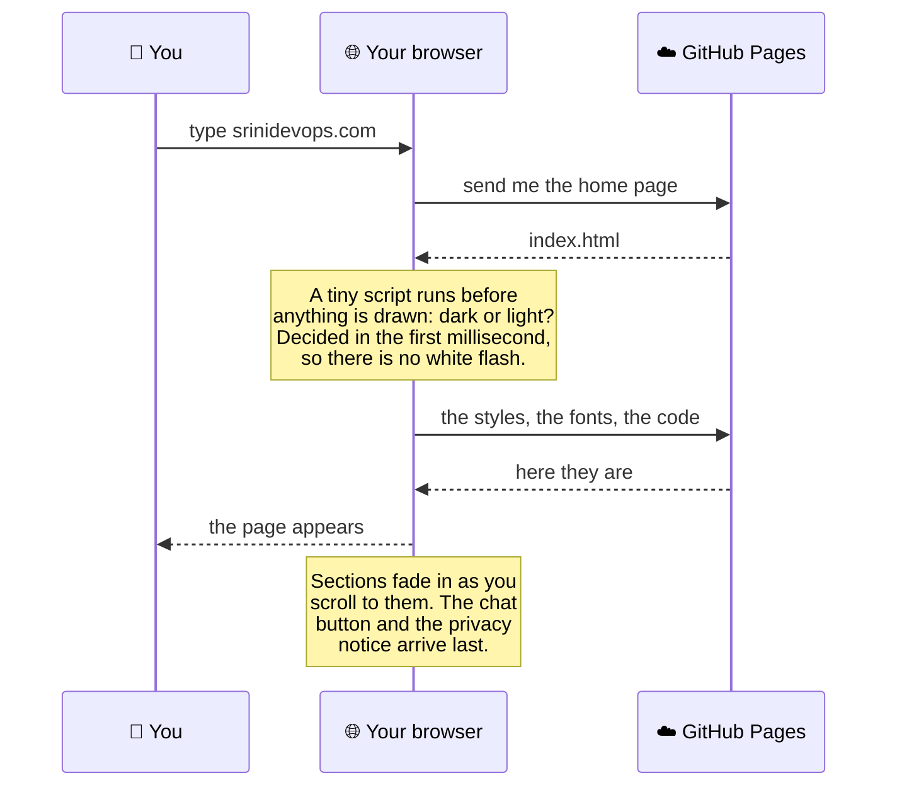
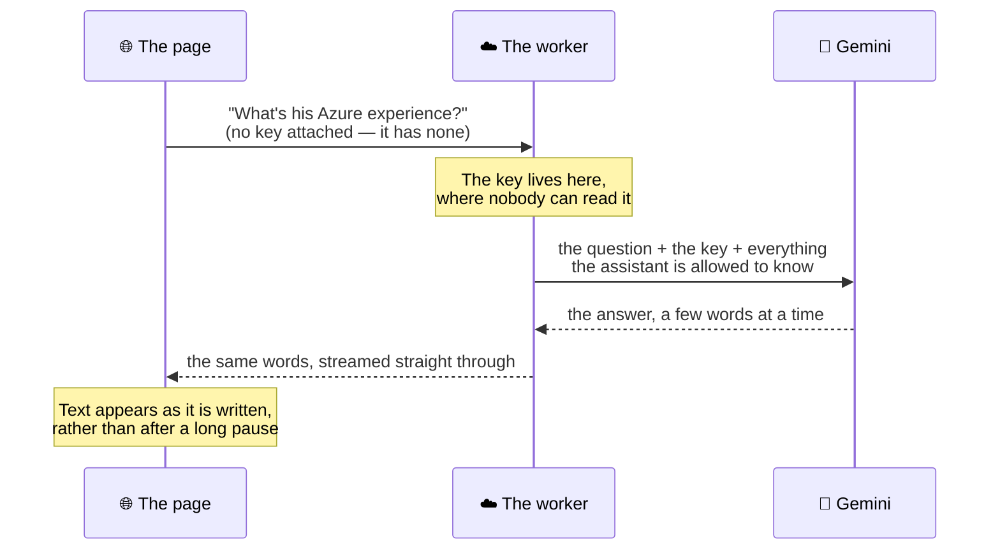
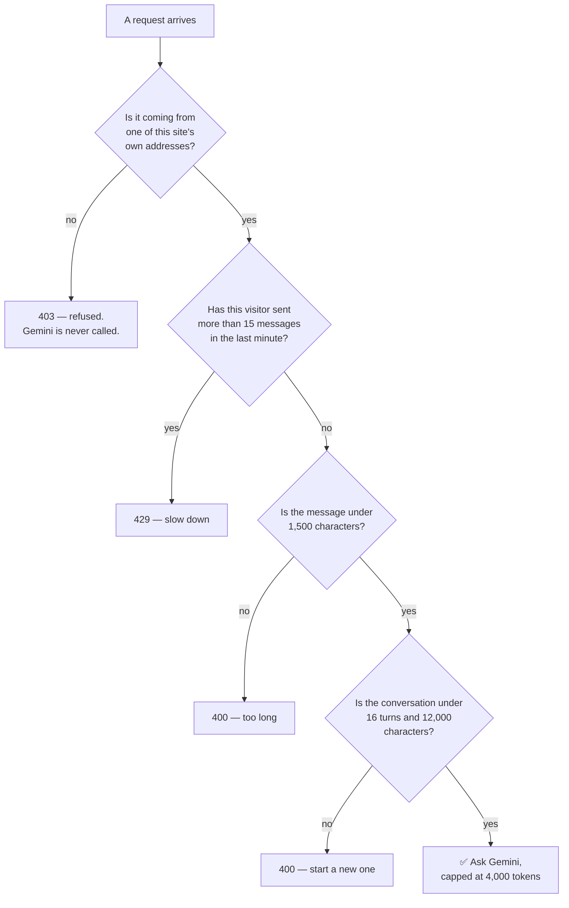
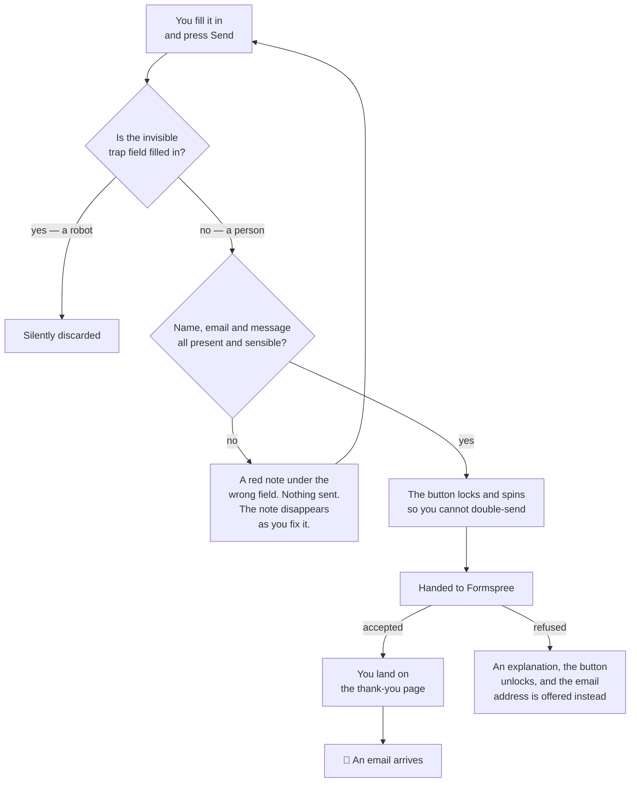
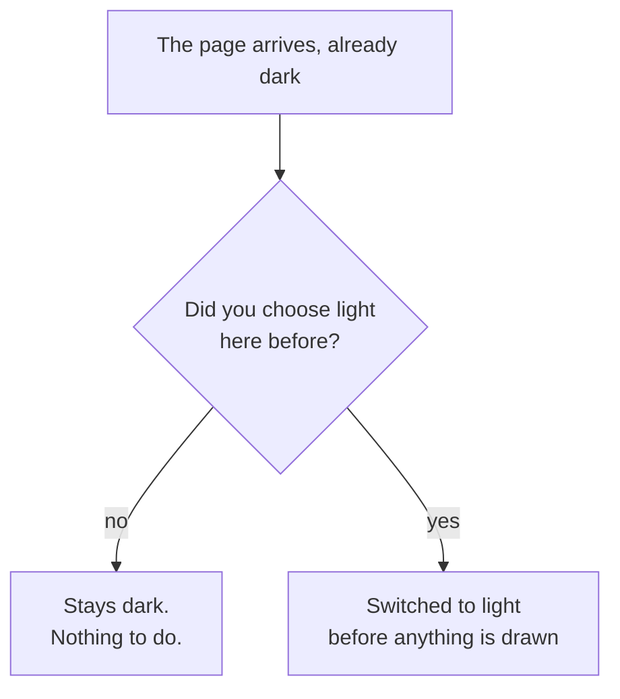
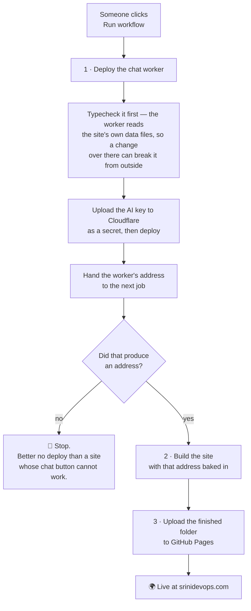

# srinidevops.com — the whole site, explained

This repository is a personal website: the portfolio of **Srinivasan Vijayaraghavan**,
a DevOps engineer in Bangalore. It lives at **[www.srinidevops.com](https://www.srinidevops.com)**.


The unusual thing about it is what is *missing*. There is no database. There is no
server sitting in a data centre waiting for visitors. Almost the entire site is a pile
of ready-made files that a browser downloads and draws, which is why it is fast, free
to run, and impossible to knock over.

---

## Table of contents

1. [The one-minute version](#1-the-one-minute-version)
2. [Explaining it plainly](#2-explaining-it-plainly)
3. [What is on the screen](#3-what-is-on-the-screen)
4. [The pages, one by one](#4-the-pages-one-by-one)
5. [What happens when you open the site](#5-what-happens-when-you-open-the-site)
6. [Type it once, use it six times](#6-type-it-once-use-it-six-times)
7. [The chat button, and where the secret lives](#7-the-chat-button-and-where-the-secret-lives)
8. [The contact form, with no post office](#8-the-contact-form-with-no-post-office)
9. [Light, dark, and the flash that never happens](#9-light-dark-and-the-flash-that-never-happens)
10. [Movement, and knowing when to stop](#10-movement-and-knowing-when-to-stop)
11. [The map of the repository](#11-the-map-of-the-repository)
12. [How it gets onto the internet](#12-how-it-gets-onto-the-internet)
13. [Running it on your own computer](#13-running-it-on-your-own-computer)
14. [Changing things without breaking them](#14-changing-things-without-breaking-them)
15. [Words you might not know](#15-words-you-might-not-know)

---

## 1. The one-minute version



Everything in this repository exists to move a visitor from box **B** to box **F**.
Every design decision below — one accent colour, one card shape, no stock photography,
no animation that outstays its welcome — is in service of that, and nothing else.

**The numbers, as the site stands today:** 14 projects, 24 certifications, four
places you can navigate to, and 27 finished pages produced by the build.

---

## 2. Explaining it plainly

Most websites work like a restaurant. You ask for a page, a kitchen somewhere cooks
it fresh — looks things up in a database, assembles the page, sends it back — and you
wait while that happens. Every visitor makes the kitchen work again.

This site works like a **vending machine**. Every page was made in advance, wrapped,
and stacked in the machine. When you ask for one, it drops out. Nobody cooks anything.

Making them in advance is a job called **the build**. It happens once, on a computer
GitHub lends us for a few minutes, and it turns the source code in this repository
into a folder of finished pages. That folder is what visitors actually get.



Three things follow from that, and they explain most of this repository:

- **It cannot go down under load.** Handing over a file is the easiest thing a
  computer does. A thousand visitors at once is not a problem to solve.
- **It costs nothing.** GitHub Pages hosts it free, and there is no machine kept
  switched on.
- **It cannot keep a secret.** Anything shipped to the browser can be read by anyone
  who looks — so the one secret this site needs, the AI key, is kept somewhere else
  entirely. That is [section 7](#7-the-chat-button-and-where-the-secret-lives), and
  it is the most interesting part of the build.

---

## 3. What is on the screen


Every page is assembled from the same small set of parts, in the same order. Learn
them once and the whole site is familiar.

| Part | What it is | Where it lives |
| --- | --- | --- |
| **Progress rail** | A hairline at the very top that fills as you scroll. The only ambient decoration left on the site. | `components/ProgressRail.tsx` |
| **Header** | The site name, four links, and the light/dark switch. Sticks to the top as you scroll. | `components/Nav.tsx` |
| **Tool strip** | Logos of the tools the work is built with, drifting slowly past. Deliberately *not* links. | `components/TechLoop.tsx` |
| **Hero** | The one sentence the page is about, one button, and a name card that tilts toward your cursor. | `components/HeroShowcase.tsx` |
| **Cards** | Skills, methods, projects, certifications, contact channels — all the same card, which glows faintly as the pointer nears it. | `components/ui/GlowCard.tsx` |
| **Stage diagram** | A row of numbered stages, drawn from real data rather than being a picture of a server rack. | `components/SystemDiagram.tsx` |
| **Footer** | Links, legal pages, copyright. | `components/Footer.tsx` |
| **Sticky bar** | On phones only: a résumé and contact bar that follows you down the page. | `components/StickyCta.tsx` |
| **Chat button** | Bottom-right, on every page. Opens the assistant. | `components/ChatWidget.tsx` |

Two of those deserve a note.

**The tool strip is not a set of links.** A row of a dozen logos that are all links
puts a dozen keyboard stops between "skip to content" and the actual navigation, and
every one of them leaves the site — while moving, under a pointer that is trying to
land on one. They are a statement of what the work is made of, so they are inert.

**On a narrow screen the header links disappear** and are replaced by a full-screen
menu built around a curved wheel you can flick with a thumb
(`components/navigation/OptionWheel.tsx`). Five text links squeezed into a 320-pixel
bar is not a menu, it is a horizontal scroll. Both interfaces read from the same list
in `lib/nav.ts`, so a new page appears in both or in neither — they cannot drift apart.

---

## 4. The pages, one by one



| Page | What it is for |
| --- | --- |
| **Home** (`app/page.tsx`) | The whole story on one scroll: the headline, seven skill areas, where he can legally work, how a release moves through a pipeline, four counters, four working principles, six shipped projects, capability tiles, and three ways to go deeper. |
| **Projects** (`app/projects/page.tsx`) | A manifest, not a gallery: one full-width row per project, grouped by area, with the group name set vertically down a rail on the left so it labels the section as you scroll past it. Hovering a row makes its line drawing *draw itself*, stroke by stroke. |
| **A project** (`app/projects/[slug]/page.tsx`) | One page per project — overview, how it works, highlights, stack, and the links. Built ahead of time, one file each. |
| **Certifications** (`app/certifications/page.tsx`) | 24 credentials as cards, filterable by six groupings, each with a link that proves it. |
| **Contact** (`app/contact/page.tsx`) | The form, three direct channels, and a 3D name badge on a lanyard that you can grab and swing. |
| **Thank you** | Where the form sends you when it worked. Marked `noindex` — nobody should arrive here from a search. |
| **Privacy / Terms** | What is collected (very little) and the rules of use. |
| **404 and error pages** | The friendly dead end, plus two safety nets that catch a page that fails to render. |

---

## 5. What happens when you open the site



The fonts are worth a line. They are downloaded from GitHub Pages with everything
else, not fetched from a font service, because they were copied into the build when
the site was made. Nothing on this page contacts a third party until *you* do
something that requires it.

---

## 6. Type it once, use it six times


The projects are not written into the pages. They live in one list —
`lib/projects.ts` — and six different parts of the site read that same list.

Add a project there and it appears on the projects page, gets a page of its own, gets
its stage diagram drawn, bumps the count on the home page, gets added to the sitemap
handed to search engines, and becomes something the chat assistant knows about. No
part of that is typed twice, so no part of it can quietly disagree with another part.

The same trick is used in a few smaller places:

- `lib/certs.ts` is the certifications, and the home page says "24 certifications" by
  **counting the list**, never by having the number typed. (It once said "11 builds"
  while the list held 12 — that is precisely the bug this prevents.)
- `lib/nav.ts` is the navigation, read by both the desktop header and the phone wheel.
- `lib/assistant.ts` holds the assistant's exact refusal sentence, shared by the site
  and by the chat worker, which are built separately and would otherwise drift.

---

## 7. The chat button, and where the secret lives

Every page has a chat button. Ask it about Srinivasan's experience and an AI answers,
word by word as it is written.

This is the one thing a pile of static files genuinely cannot do, for one reason:
**talking to an AI needs a key**, a key is a password that costs money when used, and
a static page cannot hold a password. Anyone can read a web page's source. Putting
the key in the page would be publishing it.

So the key is not in the page. It sits in a **worker** — a tiny program running on
Cloudflare's machines — and the page talks to the worker instead.



### The bouncer on the door

A worker that answers everybody is a free AI service paid for by its owner. So before
the worker spends anything, every request has to get past five checks, in this order:



The first check is the important one. It stops somebody copying this page onto their
own domain and spending the quota. And it is a *real* refusal, sent from the server —
not a CORS header, which is a rule browsers follow politely and command-line tools
ignore completely.

### What it will and will not talk about

The assistant is told, in one long instruction, that it answers questions about
Srinivasan and nothing else — no coding help, no general knowledge, no translation, no
roleplay. Anything else gets one exact refusal sentence, and the widget recognises that
sentence and labels the reply "Out of scope" rather than dressing it up as an answer.

That is a *prompt-level* boundary and this README will not pretend otherwise: it holds
for ordinary visitors and for the obvious attempts to talk it around, and someone
determined and patient may still get an off-topic sentence out of it. What caps the
damage if that happens is enforced in code, not in words — the origin check, the rate
limit and the token ceiling above.

### Where its knowledge comes from

Nothing is retyped for the assistant. When the worker is deployed it reads the site's
own `lib/projects.ts` and `lib/certs.ts`, plus a résumé file of its own
(`worker/src/profile.ts`). A project added to the site reaches the assistant on the
next deploy, automatically.

---

## 8. The contact form, with no post office

A static site cannot send email — there is no program running to send it. So the form
hands the message to **Formspree**, an outside service that emails it onward.



Three details worth knowing:

**The trap field.** There is a text box on the form that humans never see, called
`_gotcha`. Spam robots fill in every box they can find; people cannot fill in a box
that is not there. Anything with that box filled is thrown away, and the robot is told
it worked.

**It still works with JavaScript switched off.** The form is an ordinary HTML form
underneath, pointed at Formspree, with the browser's own checking. The polished
version — instant validation, the spinner, the redirect — is an upgrade layered on
top, not a requirement.

**Errors never dead-end.** Every failure message ends with the direct email address,
because a contact form that fails and offers nothing else has lost exactly the visitor
it was built for.

---

## 9. Light, dark, and the flash that never happens

The site ships **dark by default**, written into the HTML itself. That matters for
someone whose JavaScript is slow, blocked or broken: they get the correct theme
anyway, because it was never decided by a script.

The switch in the header writes your choice into `localStorage` — a small notebook
inside your own browser, which never travels anywhere. On your next visit, a five-line
script reads that notebook *before the first pixel is painted* and flips to light if
that is what you chose.



Getting the order right is the whole trick. Decide after the first paint and a
light-mode visitor gets a black screen for a heartbeat first — the effect people call
a flash, and it is the single most common bug in themed websites.

The colours themselves are deliberately few. **One accent, not four.** The palette used
to hand out four different hues per section; four accents competing at once is not a
palette, it is confetti. Colour now appears in exactly three places: links, the primary
button, and the focus ring. Error red is separate on purpose — a problem coloured like
a call to action reads as neither.

---

## 10. Movement, and knowing when to stop

Things fade upward as they come into view, headings rise once, counters count up, cards
glow near the pointer, clicks throw a small spark. All of it runs through **one**
mechanism, `lib/useInView.ts`: the browser is asked to say when an element becomes
visible, a class is added, and CSS runs a single transition.

Nothing is tied to the scroll position, so nothing recalculates while you read.

Just as important is what was **removed**, and why:

| Removed | Why |
| --- | --- |
| Smooth-scrolling library | It replaced the one thing on a page that must feel instant with a JavaScript approximation, and overrode trackpad momentum and rubber-band scrolling. |
| Scrambling headline text | It reads as noise before it reads as words — on a page with a heading every screenful, it never stops happening. |
| A WebGL background, a cursor lens, a scroll-skew driver, a corner clock | Four ambient effects at once is what made the page feel busy. Each was decoration with no subject. |
| Stock photography | A photo of a server rack says nothing about the work. The diagrams are drawn from the project's own data instead. |

And if your device is set to **reduce motion** — a setting some people genuinely need,
because animation can cause dizziness or migraine — every one of these effects is
skipped and the content is simply there.

The same care runs through the rest of the interface: a "skip to content" link appears
the moment you press Tab, the menu closes on Escape, dialogs return focus to the button
that opened them, and every interactive thing is reachable from a keyboard.

---

## 11. The map of the repository

```
app/                        one folder per page
  layout.tsx                the frame every page sits in: header, footer,
                            theme script, chat widget, social tags
  page.tsx                  home
  projects/page.tsx         the project index
  projects/[slug]/page.tsx  one page per project, built from lib/projects.ts
  certifications/page.tsx   the credential grid
  contact/page.tsx          form, channels, the 3D badge
  privacy · terms · thank-you · not-found · error
  sitemap.ts · robots.ts · manifest.ts    generated, never hand-written
  globals.css               every colour, size and space, defined once

components/                 the parts pages are built from
  Nav · Footer · ProgressRail · StickyCta · CookieNotice · Analytics
  HeroShowcase · Highlights · HowIWork · Capabilities · WorkGrid
  ProjectIndex · ProjectGrid (the line drawings) · CertIndex
  SystemDiagram · SectionHead · Reveal · SplitReveal · Bits (counters)
  ChatWidget · ContactForm · ThemeToggle · ThemeScript · ScrollProvider
  navigation/               the phone menu and its curved wheel
  ui/                       GlowCard, BorderGlow, ClickSpark, LogoLoop,
                            ProfileCard, Lanyard — the visual toys

lib/                        the facts, kept apart from the pages
  projects.ts               the 14 projects
  certs.ts                  the 24 certifications
  nav.ts                    the four routes
  chat.ts · assistant.ts    the chat endpoint, prompts and refusal line
  seo.ts                    every page's title and social card, built one way
  words.ts · useInView.ts   spelled-out numbers; the motion trigger

worker/                     the chat backend (deployed separately)
  src/index.ts              checks, caps, and the stream from Gemini
  src/knowledge.ts          what the assistant is told it may discuss
  src/profile.ts            the résumé it answers from
  wrangler.toml             allowed origins and the rate limit

public/                     files served exactly as they are:
                            icons, the social card, the résumé PDF, CNAME
scripts/make-brand-assets.mjs   redraws the icons and social card from the
                            site's own colours and fonts. Run by hand.
.github/workflows/deploy.yml    the publish button
docs/img/                   the pictures in this README
```

---

## 12. How it gets onto the internet

Nothing publishes on a push. Publishing is a decision, so it is a button someone
presses in the Actions tab.



Two things about that pipeline are deliberate and worth copying elsewhere.

**The address is passed down, never stored.** The site needs to know where its chat
worker lives, and a static site has no way to look that up while running — so the
address is baked into the files at build time. It comes from the deploy that *just
happened*, so there is no saved setting to keep in sync and no way to publish a site
pointed at yesterday's worker.

**The key is never printed.** GitHub hides registered secrets in logs on its own; the
pipeline hides all three again up front, which also covers a step that copies one into
a variable of its own. The deploy tool prints a secret's *name* when it succeeds, never
its value, and its raw output is deliberately never echoed. Only the worker's address
is written to the run summary.

Three secrets are the entire setup: the Gemini API key, a Cloudflare API token, and the
Cloudflare account ID.

---

## 13. Running it on your own computer

You need **Node.js 18 or newer** for the site. The chat worker needs **Node.js 22**.

```bash
npm install
npm run dev          # http://localhost:3000
```

That is enough to work on every page. The chat button simply does not appear, because
no worker address is configured — deliberately, since a button that fails when clicked
is worse than no button.

Other commands:

```bash
npm run build        # make the finished pages into out/
npm run typecheck    # check the types without building
npm run lint         # the usual linting
```

To work on the chat as well, in a second terminal:

```bash
cd worker
npm install
echo "GEMINI_API_KEY=..." > .dev.vars     # your own free key from AI Studio
npm run dev                                # http://localhost:8787
```

…and point the site at it by putting this in `.env.local` at the top of the repository:

```
NEXT_PUBLIC_CHAT_API=http://localhost:8787
```

Both `localhost:3000` and `localhost:8787` are already on the worker's allowed list.

---

## 14. Changing things without breaking them

A short checklist, worth reading before the first edit.

- **Add a project by editing `lib/projects.ts` only.** Six places update themselves.
  Give it the same shape as the entries around it: an overview, the stages under
  `architecture`, the highlights, the stack.
- **Never add a link that does not work.** Several projects live in private
  repositories and carry an empty `links: []` on purpose — the page turns that into
  "ask me about this one" rather than rendering a button that 404s.
- **Colours, sizes and spacing belong in `app/globals.css`**, at the top, as tokens.
  A colour written directly into a component will be wrong in one of the two themes.
- **Check both themes and a narrow window.** Flip the switch; squeeze the browser
  under 720 pixels wide, which is where the header becomes the wheel and the sticky
  bar appears.
- **Never type a number that is really a count.** Read the length of the list, the
  way the home page does.
- **New page? It needs its titles through `lib/seo.ts`** and an entry in the sitemap
  list. Every page builds its social card the same way so one can never go missing.
- **Changing what the assistant knows** means editing `worker/src/profile.ts` or its
  prompt, then deploying — the worker is a separate program and does not update itself
  when the site does.
- **The icons and the social card are generated**, not drawn by hand. If the palette
  or the fonts change, re-run `scripts/make-brand-assets.mjs` rather than editing the
  images, or they will drift away from the site they represent.

---

## 15. Words you might not know

| Word | What it means here |
| --- | --- |
| **Static site** | A website made of ready-made files. Nothing is calculated when you visit; the files are handed over as they are. |
| **Build** | The one-time job that turns source code into those ready-made files. |
| **GitHub Pages** | A free service that hosts a folder of files as a website. |
| **Next.js / React** | The toolkit the pages are written with. Here it is used only at build time, not while anyone visits. |
| **Component** | One reusable piece of a page — a card, the header, the chat widget — written once and used everywhere. |
| **CSS** | The colours, spacing and fonts. **Tokens** are named values (`--accent`) so a colour is defined once and used everywhere. |
| **Worker** | A tiny program on Cloudflare's machines. It runs only while answering a request, and it is where the AI key is kept. |
| **API key** | A password that lets you use a paid or rationed service. Never put one in a web page. |
| **Streaming** | Sending an answer word by word as it is written, instead of waiting for the whole thing. |
| **Rate limit** | A cap on how many requests one visitor may make in a period. Here: 15 a minute. |
| **Origin** | Which website a request came from. The worker refuses any origin that is not this site. |
| **localStorage** | A small notebook inside your own browser where a site can leave itself a note. It never leaves your device. |
| **Formspree** | An outside service that receives web forms and emails them onward. |
| **Plausible** | A privacy-respecting visitor counter: no cookies, no attempt to identify anyone. |
| **Honeypot** | A hidden trap field that catches spam robots, because robots fill in everything and people cannot see it. |
| **noindex** | An instruction asking search engines not to list a page. |
| **Sitemap** | A list of a site's addresses, handed to search engines. |
| **Reduced motion** | A system setting saying "please, less animation". The site honours it everywhere. |
| **SSE** | Server-sent events — the simple one-way channel the chat answers stream over. |
| **CI/CD** | Automation that builds, checks and ships software. It is also most of what this site is about. |

---

**Contact:** [srinivasan.shyam2000@gmail.com](mailto:srinivasan.shyam2000@gmail.com) ·
[LinkedIn](https://www.linkedin.com/in/srini-solution-architect/) ·
[GitHub](https://github.com/Srinivasan-78) · Bangalore, India
